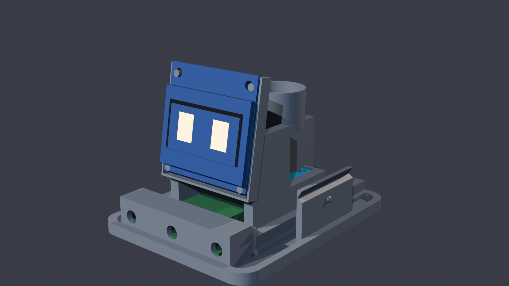
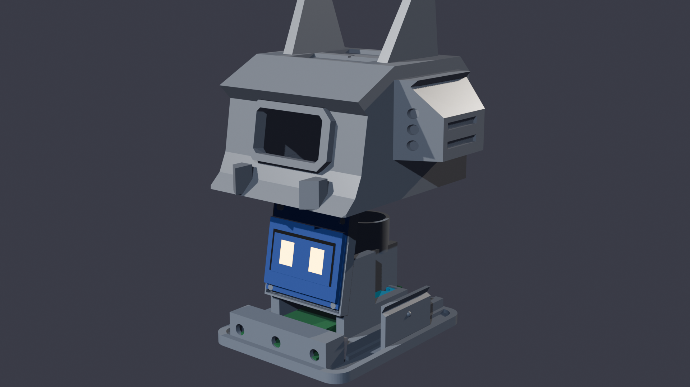
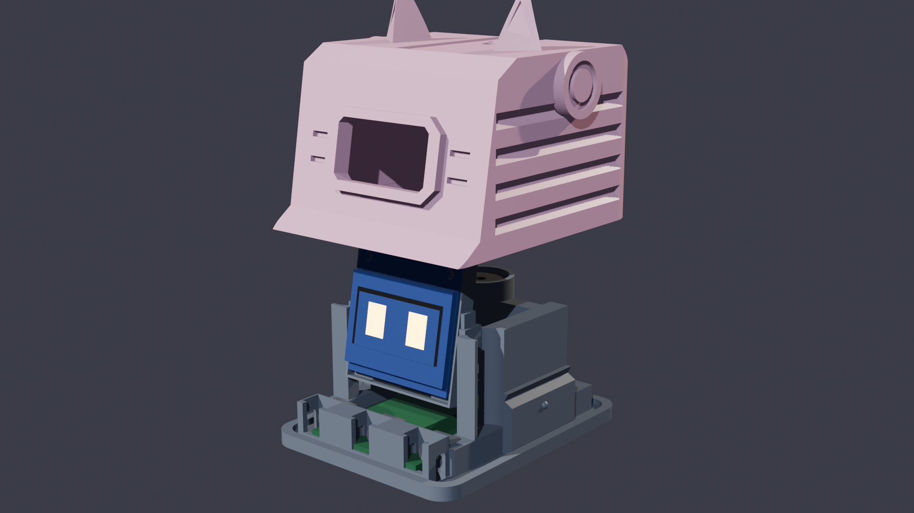
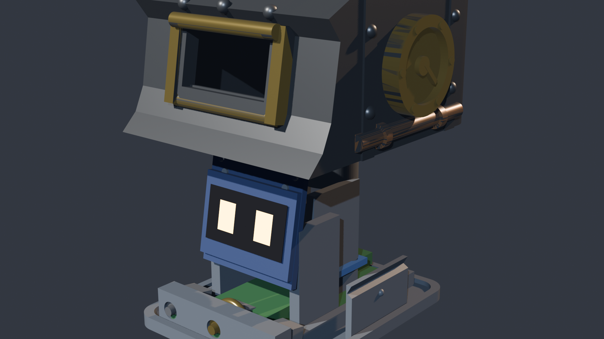

# 🤖 ESP32 Robot Desk Pet — Kompletny Przewodnik

Interaktywny miniaturowy robot biurkowy (**Desk Companion Pet**) oparty na mikrokontrolerze **ESP32**, wyświetlaczu OLED 0.96", akcelerometrze/żyroskopie **MPU-6050**, podwójnym pojemnościowym czujniku głaskania oraz pasywnym buzzerze piezo.

Dzięki **modułowej architekturze Core-and-Armor** całą elektronikę montujesz i podłączasz **tylko jeden raz** w centralnym stelażu, a wygląd zewnętrzny robota możesz zmieniać w sekundę, nasuwając wybraną obudowę (**Cyber-Titan Apex**, **Mecha-Kawaii**, **Retro CRT** lub **Steam-Titan Nautilus**) bez rozkręcania śrub i bez dotykania kabli!

---

## ⚡ Spis Treści
1. [KROK 1: Flashowanie ESP32 (Wgrywanie programu)](#-krok-1-flashowanie-esp32-wgrywanie-programu)
2. [KROK 2: Druk 3D — Dokładna lista plików STL (4 style)](#-krok-2-druk-3d--dokładna-lista-plików-stl)
3. [KROK 3: Schemat połączeń przewodów (Hardware Pinout)](#-krok-3-schemat-połączeń-przewodów-hardware-pinout)
4. [KROK 4: Montaż elektroniki w stelażu (Złóż raz i zapomnij!)](#-krok-4-montaż-elektroniki-w-stelażu-złóż-raz-i-zapomnij)
5. [KROK 5: Błyskawiczna wymiana obudów (Quick-Swap Slide-On)](#-krok-5-błyskawiczna-wymiana-obudów-quick-swap-slide-on)
6. [✨ Funkcje, animacje i sterowanie](#-funkcje-animacje-i-sterowanie)
7. [📦 Lista zakupowa części (BOM)](#-lista-zakupowa-części-bom)

---

## ⚡ KROK 1: Flashowanie ESP32 (Wgrywanie programu)

Kod robota znajduje się w pliku [`src/main.cpp`](src/main.cpp), a konfiguracja projektu, parametry mikrokontrolera i biblioteki są zdefiniowane w [`platformio.ini`](platformio.ini).

### Wymagania:
* Płytka **ESP32 DevKit V1** (30-pin, polecane z gniazdem USB-C lub microUSB).
* Kabel USB **do transmisji danych** (nie tylko do ładowania!).
* Komputer z Windows, macOS lub Linux.

---

### Metoda A: Przez VS Code + PlatformIO IDE (Najprostsza — Zalecana)

1. **Pobierz i zainstaluj edytor [VS Code (Visual Studio Code)](https://code.visualstudio.com/)**.
2. W VS Code przejdź do zakładki rozszerzeń (`Ctrl + Shift + X`), wyszukaj **PlatformIO IDE** i kliknij **Install**.
3. Kliknij `File -> Open Folder...` i wskaż sklonowany folder projektu:
   ```bash
   esp32-robot
   ```
4. Podłącz płytkę ESP32 kablem USB do portu komputera.
5. Na dolnym niebieskim pasku VS Code pojawią się ikonki PlatformIO:
   * **`✓` (Build)**: kompilacja programu.
   * **`→` (Upload)**: automatyczna kompilacja i wgranie programu do pamięci ESP32!
   * **`🔌` (Serial Monitor)**: podgląd logów diagnostycznych (115200 baud).
6. Kliknij **`→` (Upload)**. PlatformIO samoczynnie pobierze wymagane biblioteki (Adafruit SSD1306, GFX, MPU6050, BusIO), skompiluje kod i wgra go na Twoją płytkę.
7. Po wgraniu robot wyda powitalny dźwięk i otworzy animowane oczy na ekranie!

---

### Metoda B: Przez Terminal (CLI)

Jeśli wolisz terminal, wystarczy wpisać:

```bash
# 1. Przejdź do katalogu projektu
cd esp32-robot

# 2. Skompiluj i wgraj program na podłączone ESP32
pio run -t upload

# 3. Otwórz monitor portu szeregowego
pio device monitor -b 115200
```
*(Jeśli komenda `pio` nie jest w ścieżce PATH, użyj pełnej ścieżki: `~/.platformio/penv/bin/pio run -t upload`)*

---

### ❓ Rozwiązywanie problemów z wgrywaniem:

* **Błąd `Connecting........_____.....`**:  
  Niektóre płytki ESP32 wymagają ręcznego wejścia w tryb bootloadera. Gdy na ekranie pojawi się napis `Connecting...`, **naciśnij i przytrzymaj przez 2 sekundy przycisk BOOT** na płytce ESP32, po czym puść.
* **Komputer nie widzi portu COM / `/dev/ttyUSB0`**:  
  Zainstaluj uniwersalne sterowniki układu USB-UART dla ESP32: **CP2102** (Silicon Labs) lub **CH340**.
* **Chcesz przetestować kod bez fizycznej płytki?**  
  Projekt zawiera plik [`diagram.json`](diagram.json) — możesz uruchomić pełną symulację robota w wirtualnym środowisku **Wokwi** w przeglądarce!

---

## 🖨️ KROK 2: Druk 3D — Dokładna lista plików STL

Projekt wykorzystuje modułowy system **Core-and-Armor**:
1. **Drukujesz ZAWSZE 1x Stelaż Centralny (Core Chassis)** — to w nim na stałe mieszka cała elektronika.
2. **Wybierasz 1 z 3 obudów zewnętrznych (Głowa + Klawisze)** — nasuwasz ją od góry na stelaż!

---

### 🧩 CZĘŚĆ 1: Centralny Stelaż (Drukujesz ZAWSZE, 1 raz dla każdego robota)

| Plik STL | Ilość | Ścieżka do pliku | Uwagi montażowe |
| :--- | :---: | :--- | :--- |
| **`core_chassis.stl`** | **1 szt.** | [`cad_models/stl_print/core_chassis.stl`](cad_models/stl_print/core_chassis.stl) | Płasko na spodzie (Z=0). Mieści ESP32, OLED pod kątem 80°, buzzer 12mm, MPU6050 i 3 switche. |

---

### 🎭 CZĘŚĆ 2: Wybierz 1 z 3 Obudów Zewnętrznych (Nasuwasz na stelaż)

#### 🛡️ Opcja A: Cyber-Titan Apex (Ciężki Mech Bojowy 72mm z wyrzutniami, rogami i dyszami)
*Klimat: Armored Core / Gundam Heavy Assault. Agresywna sylwetka V-Taper, potężne naramienniki 72mm z wyrzutniami rakiet, 68mm rogi bojowe V-Fin, kły mandibles i podwójne dysze dopalaczy.*

| Plik STL | Ilość | Ścieżka do pliku | Zalecany kolor filamentu |
| :--- | :---: | :--- | :--- |
| **`dreadnought_glowa.stl`** | **1 szt.** | [`cad_models/stl_print/dreadnought/dreadnought_glowa.stl`](cad_models/stl_print/dreadnought/dreadnought_glowa.stl) | Matowy grafit / Carbon Black |
| **`dreadnought_przycisk_romb.stl`** | **1 szt.** | [`cad_models/stl_print/dreadnought/dreadnought_przycisk_romb.stl`](cad_models/stl_print/dreadnought/dreadnought_przycisk_romb.stl) | Złoty metalik lub Cyber Pomarańcz |
| **`dreadnought_przycisk_strzalka_l.stl`** | **1 szt.** | [`cad_models/stl_print/dreadnought/dreadnought_przycisk_strzalka_l.stl`](cad_models/stl_print/dreadnought/dreadnought_przycisk_strzalka_l.stl) | Tytanowy szary / Ciemny grafit |
| **`dreadnought_przycisk_strzalka_p.stl`** | **1 szt.** | [`cad_models/stl_print/dreadnought/dreadnought_przycisk_strzalka_p.stl`](cad_models/stl_print/dreadnought/dreadnought_przycisk_strzalka_p.stl) | Tytanowy szary / Ciemny grafit |
| *`dreadnought_podstawa.stl`* | *(opcjonalnie)* | [`cad_models/stl_print/dreadnought/dreadnought_podstawa.stl`](cad_models/stl_print/dreadnought/dreadnought_podstawa.stl) | *Opcjonalna baza ze stopami czołgowymi* |

---

#### 🌸 Opcja B: Cyber-Capsule Mecha-Kawaii (Anime Kotek Neko ze szponterami)
*Klimat: Cyberpunk Anime Companion. Przestrzenny wizjer 3D, kocie uszka, nauszniki Audio-Pod, 4 boczne żebra pancerza ("szpontery"), wąsy i przyciski z serduszkiem oraz łapkami.*

| Plik STL | Ilość | Ścieżka do pliku | Zalecany kolor filamentu |
| :--- | :---: | :--- | :--- |
| **`mecha_kawaii_glowa.stl`** | **1 szt.** | [`cad_models/stl_print/mecha_kawaii/mecha_kawaii_glowa.stl`](cad_models/stl_print/mecha_kawaii/mecha_kawaii_glowa.stl) | Pastel Sakura Pink / Perłowa biel |
| **`mecha_kawaii_przycisk_serce.stl`** | **1 szt.** | [`cad_models/stl_print/mecha_kawaii/mecha_kawaii_przycisk_serce.stl`](cad_models/stl_print/mecha_kawaii/mecha_kawaii_przycisk_serce.stl) | Neon Fuksja / Czerwony |
| **`mecha_kawaii_przycisk_lapka.stl`** | **2 szt.** | [`cad_models/stl_print/mecha_kawaii/mecha_kawaii_przycisk_lapka.stl`](cad_models/stl_print/mecha_kawaii/mecha_kawaii_przycisk_lapka.stl) | Śmietankowa biel |
| *`mecha_kawaii_podstawa.stl`* | *(opcjonalnie)* | [`cad_models/stl_print/mecha_kawaii/mecha_kawaii_podstawa.stl`](cad_models/stl_print/mecha_kawaii/mecha_kawaii_podstawa.stl) | *Opcjonalna baza z przednimi łapkami* |

---

#### 📺 Opcja C: Retro CRT Minimalist (Klasyczny Komputer Biurkowy Vintage)
*Klimat: Macintosh 1984 / Dieter Rams Braun. Minimalistyczna bryła o miękkich krawędziach R4, zlicowane okno ekranu i ergonomiczne kopułki przycisków.*

| Plik STL | Ilość | Ścieżka do pliku | Zalecany kolor filamentu |
| :--- | :---: | :--- | :--- |
| **`obudowa_gora_glowa.stl`** | **1 szt.** | [`cad_models/stl_print/obudowa_gora_glowa.stl`](cad_models/stl_print/obudowa_gora_glowa.stl) | Kość słoniowa / Vintage Grey |
| **`przycisk_nakladka.stl`** | **3 szt.** | [`cad_models/stl_print/przycisk_nakladka.stl`](cad_models/stl_print/przycisk_nakladka.stl) | Turkusowy Cyan / Żółty akcent retro |
| *`obudowa_dol_podstawa.stl`* | *(opcjonalnie)* | [`cad_models/stl_print/obudowa_dol_podstawa.stl`](cad_models/stl_print/obudowa_dol_podstawa.stl) | *Opcjonalna klasyczna baza* |

---

#### ⚙️ Opcja D: Steam-Titan Nautilus (Industrial Steampunk / Parowy Kocioł Bojowy)
*Klimat: Victorian Industrial / BioShock Nautilus. Zaokrąglona czasza kotła parowego z 32 nitami 3D, potrójna klatka ochronna iluminatora (roll-cage), podwójne wiktoriańskie kominy z kryzami, boczne manometry ciśnienia pary ze wskazówkami w czerwonej strefie, miedziane rurociągi oraz mosiężne koło zaworowe jako przycisk.*

| Plik STL | Ilość | Ścieżka do pliku | Zalecany kolor filamentu |
| :--- | :---: | :--- | :--- |
| **`dieselpunk_glowa.stl`** | **1 szt.** | [`cad_models/stl_print/dieselpunk/dieselpunk_glowa.stl`](cad_models/stl_print/dieselpunk/dieselpunk_glowa.stl) | Stal kotłowa / Ciemny grafit / Mosiądz Silk |
| **`dieselpunk_przycisk_zawor.stl`** | **1 szt.** | [`cad_models/stl_print/dieselpunk/dieselpunk_przycisk_zawor.stl`](cad_models/stl_print/dieselpunk/dieselpunk_przycisk_zawor.stl) | Złoty Mosiądz / Polerowany brąz |
| **`dieselpunk_przycisk_ryfel_l.stl`** | **1 szt.** | [`cad_models/stl_print/dieselpunk/dieselpunk_przycisk_ryfel_l.stl`](cad_models/stl_print/dieselpunk/dieselpunk_przycisk_ryfel_l.stl) | Oksydowana stal / Gunmetal |
| **`dieselpunk_przycisk_ryfel_p.stl`** | **1 szt.** | [`cad_models/stl_print/dieselpunk/dieselpunk_przycisk_ryfel_p.stl`](cad_models/stl_print/dieselpunk/dieselpunk_przycisk_ryfel_p.stl) | Oksydowana stal / Gunmetal |
| *`dieselpunk_podstawa.stl`* | *(opcjonalnie)* | [`cad_models/stl_print/dieselpunk/dieselpunk_podstawa.stl`](cad_models/stl_print/dieselpunk/dieselpunk_podstawa.stl) | *Opcjonalna baza kotła ze stopami śrubowymi* |

---

### ⚙️ Rekomendowane Ustawienia Slicera (Bambu Studio / OrcaSlicer / PrusaSlicer / Cura):

* **Materiał**: PLA lub PETG.
* **Wysokość warstwy (Layer height)**:
  * Stelaż i obudowy główne: `0.20 mm`
  * Przyciski: `0.16 mm` (zapewnia idealną gładkość ikonek i kołnierzy).
* **Ścianki / Obrysy (Walls / Perimeters)**: `3 lub 4` (min. 1.2 – 1.6 mm grubości).
* **Wypełnienie (Infill)**: `15% – 20%` (Zalecany wzór: **Gyroid**).
* **Podpory (Supports)**: **WYŁĄCZONE (Supports: OFF / None)**.  
  *Wszystkie skosy, daszki, wyrzutnie rakiet i rogi zaprojektowano pod kątem $\le 45^\circ$, co gwarantuje czysty, idealny wydruk bez jakichkolwiek podpór!*

---

## 📌 KROK 3: Schemat połączeń przewodów (Hardware Pinout)

Podłącz komponenty do odpowiednich pinów ESP32:

| Urządzenie | Wyprowadzenie (Pin) | Pin ESP32 | Funkcja i opis |
| :--- | :--- | :--- | :--- |
| **Wyświetlacz OLED 0.96"** | **SDA** | **GPIO 21** | Szyna danych I2C |
| (SSD1306 128x64) | **SCL** | **GPIO 22** | Szyna zegara I2C |
| | **VCC** | **3.3V** | Zasilanie logiczne ekranu |
| | **GND** | **GND** | Wspólna masa |
| **Czujnik MPU-6050** | **SDA** | **GPIO 21** | Wspólna linia danych magistrali I2C |
| (Żyroskop / Akcelerometr) | **SCL** | **GPIO 22** | Wspólna linia zegara magistrali I2C |
| | **VCC** | **3.3V** lub **5V** | Zasilanie czujnika ruchu |
| | **GND** | **GND** | Wspólna masa |
| **Buzzer Pasywny 12mm** | **+ (Sygnał)** | **GPIO 25** | Generowanie tonów PWM |
| | **-** | **GND** | Wspólna masa |
| **Przycisk LEWY** | Pin 1 | **GPIO 18** | Drugi pin przycisku do **GND** (wbudowany PULLUP) |
| **Przycisk ŚRODEK (OK)** | Pin 1 | **GPIO 19** | Drugi pin przycisku do **GND** (wbudowany PULLUP) |
| **Przycisk PRAWY** | Pin 1 | **GPIO 23** | Drugi pin przycisku do **GND** (wbudowany PULLUP) |
| **Strefa dotyku PRZÓD** | Pasek folii A | **GPIO 32** (T9) | Dotyk pojemnościowy (1 kabelek do folii) |
| **Strefa dotyku TYŁ** | Pasek folii B | **GPIO 33** (T8) | Dotyk pojemnościowy (1 kabelek do folii) |

> [!TIP]
> **Jak wykonać strefy głaskania z folii aluminiowej?**
> 1. Wytnij dwa paski zwykłej kuchennej folii aluminiowej o wymiarach ok. **15 mm x 30 mm**.
> 2. Przyklej taśmą lub przylutuj po jednym kabelku: jeden do pinu **GPIO 32**, drugi do **GPIO 33**.
> 3. Paski umieść pod dachem obudowy (jeden z przodu na czole, drugi z tyłu głowy).
> 4. Przy każdym uruchomieniu ESP32 samoczynnie kalibruje czułość do Twojej dłoni i grubości plastiku!

---

## 🛠️ KROK 4: Montaż elektroniki w stelażu (Złóż raz i zapomnij!)

Całą elektronikę osadzasz trwale w wydrukowanym stelażu [`core_chassis.stl`](cad_models/stl_print/core_chassis.stl):

1. **Przyciski**: Wsuń 3 mikroprzełączniki Tact Switch 6x6 mm w przednie gniazda stelaża. Opierają się o solidną tylną ścianę, dzięki czemu nie uginają się przy klikaniu.
2. **ESP32**: Wsuń płytkę ESP32 DevKit V1 w szyny prowadzące stelaża od góry, aż kliknie w zatrzaski krawędziowe. Port USB idealnie zgra się z tylnym oknem.
3. **MPU-6050**: Połóż czujnik poziomo w dedykowanej niecce między szynami.
4. **OLED 0.96"**: Wsuń wyświetlacz w ramkę masztu nachylonego pod fabrycznym kątem **80°**. Cztery kołki centrujące zablokują ekran w osi okna.
5. **Buzzer 12mm**: Wciśnij przetwornik w cylindryczny koszyk na szczycie wieży (press-fit na klik). Dźwięk skierowany jest wprost do góry.
6. **Nóżki**: Wklej 4 silikonowe nóżki antypoślizgowe (fi 8 mm) w gniazda na spodzie stelaża.

Stelaż z podłączonym kablem USB stoi teraz stabilnie na Twoim biurku!

---

## 🎭 KROK 5: Błyskawiczna wymiana obudów (Quick-Swap Slide-On)

| 🧩 1. Stelaż Core | 🛡️ 2. Titan Apex | 🌸 3. Neko Kawaii | ⚙️ 4. Steam Nautilus |
| :---: | :---: | :---: | :---: |
|  |  |  |  |

1. Weź wybraną obudowę (np. **Cyber-Titan Apex**, **Mecha-Kawaii** lub **Steam-Titan Nautilus**).
2. Wsuń od środka w jej przednie otwory dedykowane nakładki przycisków (kołnierz zabezpiecza je przed wypadnięciem).
3. **Nasuń obudowę od góry na stelaż**: wewnętrzne szyny prowadzące gładko poprowadzą obudowę w dół, a dolne zatrzaski kulkowe klikną na dole.
4. **Chcesz zmienić robota w kotka, mecha bojowego lub parowy kocioł?**  
   Po prostu chwyć obudowę, pociągnij w górę i załóż inną! Zero śrubokrętów, zero odpinania kabli!

---

## ✨ Funkcje, animacje i sterowanie

* 👀 **Żywe, animowane oczy OLED**: Płynne mruganie, naturalne zerkanie na boki, 5 stylów oczu (*Standard, Cat Eyes, Cyber, Hearts, Anime*) oraz 4 motywy graficzne.
* 🥰 **Wykrywanie gestu głaskania (Petting)**: Przejechanie dłonią od czoła do tyłu głowy wyzwala wieloetapową animację zadowolenia (bijące serca, rumieńce, uroczy pyszczek `ω`, mruczenie kota). Głaskanie pod włos wywołuje zdziwienie z pytajnikiem `?`.
* 📳 **Czujnik ruchu**: Robot zasypia po bezczynności i budzi się po podniesieniu lub potrząśnięciu.
* 📋 **Menu Kafelkowe**:
  1. *Eye Style* (wybór oczu i motywu graficznego)
  2. *Pomodoro* (stoper pracy 25 min)
  3. *Dino Jump* (gra zręcznościowa na ekranie)
  4. *Exit* (powrót do trybu zwierzaka)
* 💻 **Diagnostyka przez Serial Monitor (115200 baud)**:
  Wpisz w konsoli: `touch` (odczyt czułości), `calib` (autokalibracja dotyku), `pet` (test głaskania), `shake` (test ruchu).

---

## 🎨 Gotowe Projekty 3D i Blender

Wszystkie pliki źródłowe znajdziesz w katalogu [`cad_models/`](cad_models/):
* ⚙️ **Projekt Blendera Steam-Titan Nautilus:** [`cad_models/robot_dieselpunk.blend`](cad_models/robot_dieselpunk.blend)
* 🛡️ **Projekt Blendera Cyber-Titan Apex:** [`cad_models/robot_dreadnought.blend`](cad_models/robot_dreadnought.blend)
* 🌸 **Projekt Blendera Mecha-Kawaii:** [`cad_models/robot_mecha_kawaii.blend`](cad_models/robot_mecha_kawaii.blend)
* 📺 **Projekt Blendera Retro CRT:** [`cad_models/robot_obudowa_klasyczna.blend`](cad_models/robot_obudowa_klasyczna.blend)
* 🧩 **Projekt Blendera Stelaża i Slide-On:** [`cad_models/robot_modular_core.blend`](cad_models/robot_modular_core.blend)
* 📐 **Parametryczne modele FreeCAD i pliki STEP:** [`cad_models/robot_dieselpunk_3d.FCStd`](cad_models/robot_dieselpunk_3d.FCStd), [`cad_models/core_chassis.step`](cad_models/core_chassis.step), [`cad_models/robot_core_chassis.FCStd`](cad_models/robot_core_chassis.FCStd)

---

## 📦 Lista zakupowa części (BOM)

1. **1x ESP32 DevKit V1** (30-pin, CP2102 lub CH340).
2. **1x Wyświetlacz OLED 0.96" I2C SSD1306** (128x64, kolor biały lub niebieski).
3. **1x Moduł MPU-6050** (GY-521, 3-osiowy akcelerometr + żyroskop).
4. **1x Buzzer Pasywny Piezo 12mm** (Passive Piezo Buzzer 5V/3.3V).
5. **3x Mikroprzełączniki Tact Switch 6x6 mm** (wysokość trzpienia 4.3 mm – 7 mm).
6. **Przewody Dupont żeńsko-żeńskie** (10-15 cm) + kawałek folii aluminiowej kuchennej.
7. **4x Samoprzylepne nóżki silikonowe fi 8 mm** (na spód stelaża).
