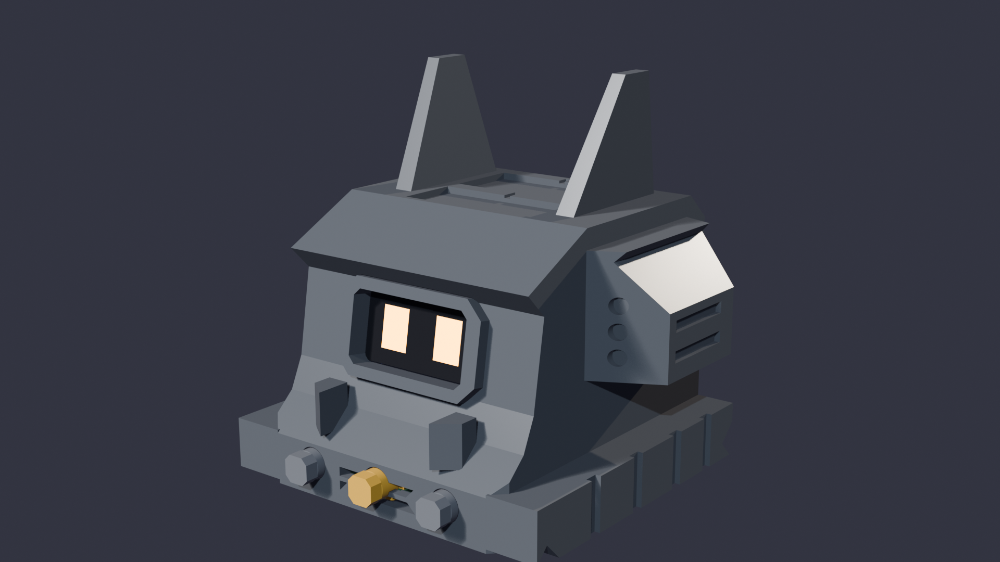
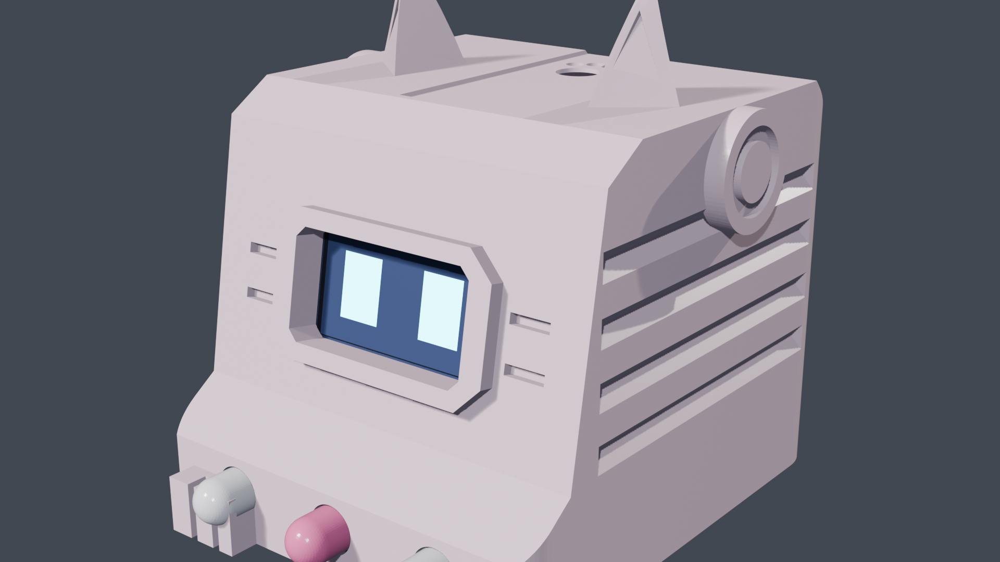
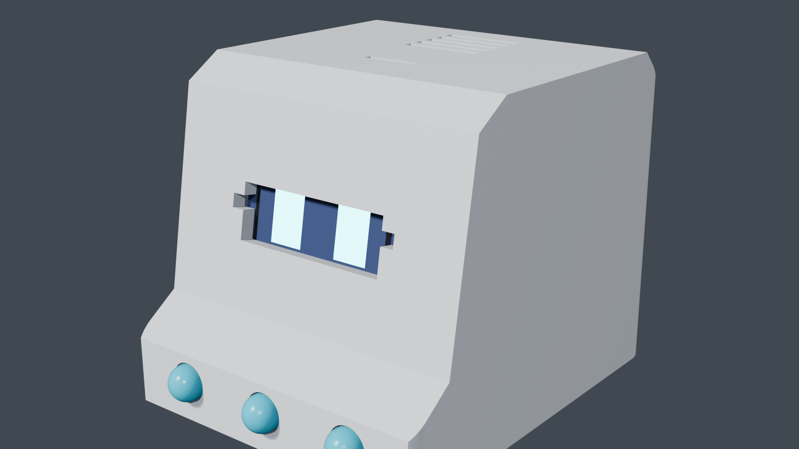

# 🤖 ESP32 Robot Desk Pet

Interaktywny miniaturowy robot biurkowy (Companion Pet) oparty na mikrokontrolerze **ESP32**, wyświetlaczu OLED 0.96" I2C, czujniku ruchu **MPU-6050**, podwójnym czujniku dotyku pojemnościowego do głaskania oraz pasywnym buzzerze.

Projekt jest w 100% gotowy do natychmiastowego wgrania na fizyczną płytkę ESP32 (Plug & Play), a jednocześnie zawiera pełną symulację w **Wokwi** (`diagram.json`).

---

## ⚡ Szybki start (Quick Start w 3 krokach)

Jeśli sklonowałeś to repozytorium, wystarczy:

```bash
# 1. Wejdź do katalogu projektu
cd esp32-robot

# 2. Podłącz ESP32 kablem USB do komputera i wgraj program
pio run -t upload

# 3. Otwórz monitor portu szeregowego (opcjonalnie, do podglądu i testów)
pio device monitor -b 115200
```
Po wgraniu robot od razu ożyje, wyda powitalny dźwięk i otworzy oczy!

---

## 🖨️ Trzy Przemyślane Obudowy 3D do Wyboru (Design for 3D Printing)

Projekt zawiera **trzy kompletne, w 100% przetestowane obudowy biurkowe**, w pełni kompatybilne z tą samą elektroniką i zoptymalizowane pod kątem łatwego druku FDM bez trudnych podpór:

| 🛡️ Edycja Cyber-Titan Apex (Mecha-Warrior) | 🌸 Edycja Cyber-Capsule Mecha-Kawaii | 📺 Edycja Retro CRT Minimalist |
| :---: | :---: | :---: |
|  |  |  |
| *Ciężki szturmowy mech bojowy: potężna rozpiętość 72mm, naramienniki z wyrzutniami rakiet, 68mm rogi V-Fin / Kabuto, daszek kokpitu blast-shield, kły bojowe mandibles, podwójne dysze dopalaczy odrzutowych i gąsienice pancerne 63mm.* | *Styl Anime Neko: oktagonalny wizjer 3D, boczne żebra ("szpontery"), kocie wąsy, uszka, kapsuły Audio-Pod, przednie łapki i klawisze serce/łapka.* | *Styl Retro Computer: minimalistyczna bryła biurkowa o gładkich zaokrągleniach, zlicowanym oknie ekranu i klasycznych przyciskach.* |

### Najważniejsze atuty konstrukcyjne:
- **Dolne chassis**: drukowane w 100% na płasko na stole roboczym (**0 podpór**). Posiada szyny na ESP32, kanał na piny/przewody, wycięcie na kabel USB oraz 4 ukryte gniazda na śruby M3 i nóżki silikonowe.
- **Górny korpus / Głowa**: ergonomiczne nachylenie twarzy pod kątem ~80° (tylko ~9.5° od pionu – **brak konieczności podpór** na ścianach!), okno na wyświetlacz OLED 0.96", grill akustyczny buzzera oraz dedykowane łoża pod folię dotykową o ściance zredukowanej do **1.0 mm** dla maksymalnej czułości głaskania.
- **Ruchome nakładki przycisków**: klawisze z kołnierzem oporowym zabezpieczającym przed wypadaniem.
- **Boczne żebra i radiatory**: nacięcia pancerza i radiatorów wykonane pod bezpiecznym kątem 45° (drukowalne bez zwisów).

📂 **Pliki STL Cyber-Titan Apex:** [`cad_models/stl_print/dreadnought/`](cad_models/stl_print/dreadnought/)  
📂 **Pliki STL Mecha-Kawaii:** [`cad_models/stl_print/mecha_kawaii/`](cad_models/stl_print/mecha_kawaii/)  
📂 **Pliki STL Retro CRT:** [`cad_models/stl_print/`](cad_models/stl_print/)  
📖 **Kompletny poradnik druku i montażu krok po kroku:** [`cad_models/DRUK_I_MONTAZ.md`](cad_models/DRUK_I_MONTAZ.md)  
🎨 **Gotowe projekty Blender (.blend):**  
  - 🛡️ [`cad_models/robot_dreadnought.blend`](cad_models/robot_dreadnought.blend) — dedykowany model Cyber-Titan Apex w kolorze Gunmetal Carbon z podwójnymi dyszami dopalaczy i bursztynowym oświetleniem bojowym!  
  - 🌸 [`cad_models/robot_mecha_kawaii.blend`](cad_models/robot_mecha_kawaii.blend) — dedykowany model Mecha Kawaii w kolorze Sakura  
  - 📺 [`cad_models/robot_obudowa_klasyczna.blend`](cad_models/robot_obudowa_klasyczna.blend) — dedykowany model edycji klasycznej  
  - 📦 [`cad_models/robot_projekt.blend`](cad_models/robot_projekt.blend) — zbiorczy projekt ze wszystkimi wersjami  
📐 **Projekty parametryczne FreeCAD i STEP:** [`cad_models/robot_dreadnought_3d.FCStd`](cad_models/robot_dreadnought_3d.FCStd), [`cad_models/robot_mecha_kawaii_3d.FCStd`](cad_models/robot_mecha_kawaii_3d.FCStd) oraz [`cad_models/robot_obudowa_3d.FCStd`](cad_models/robot_obudowa_3d.FCStd)

---

## 📌 Schemat Połączeń (Hardware Pinout)

Podłącz komponenty do pinów ESP32 zgodnie z poniższą tabelą:

| Komponent | Pin modułu | Pin ESP32 | Uwagi / Podłączenie |
| :--- | :--- | :--- | :--- |
| **OLED 0.96" I2C** (SSD1306) | **SDA** | **GPIO 21** | Szyna danych I2C |
| | **SCL** | **GPIO 22** | Szyna zegara I2C |
| | **VCC** | **3.3V** | Zasilanie ekranu |
| | **GND** | **GND** | Masa |
| **MPU-6050** (GY-521) | **SDA** | **GPIO 21** | Wspólna szyna I2C z OLED |
| | **SCL** | **GPIO 22** | Wspólna szyna I2C z OLED |
| | **VCC** | **3.3V** lub **5V** | Zasilanie czujnika |
| | **GND** | **GND** | Masa |
| **Buzzer pasywny** | **+ (Sygnał)** | **GPIO 25** | Generowanie dźwięków PWM |
| | **-** | **GND** | Masa |
| **Przycisk LEWO** | Pin 1 | **GPIO 18** | Drugi pin do **GND** (wbudowany PULLUP) |
| **Przycisk OK** | Pin 1 | **GPIO 19** | Drugi pin do **GND** (wbudowany PULLUP) |
| **Przycisk PRAWO** | Pin 1 | **GPIO 23** | Drugi pin do **GND** (wbudowany PULLUP) |
| **Pasek A: Dotyk PRZÓD** | Folia | **GPIO 32** (T9) | Tylko 1 kabelek do paska folii! |
| **Pasek B: Dotyk TYŁ** | Folia | **GPIO 33** (T8) | Tylko 1 kabelek do paska folii! |

> [!TIP]
> **Jak zrobić paski do głaskania?**
> 1. Wytnij dwa małe kawałki zwykłej folii aluminiowej kuchennej (ok. 1.5 cm x 4 cm).
> 2. Naklej je od spodu dachu obudowy robota: jeden z przodu (czoło), drugi z tyłu głowy (odstęp między nimi ok. 5–10 mm).
> 3. Przyklej taśmą lub przylutuj po jednym kabelku: przedni do pinu **GPIO 32**, a tylny do pinu **GPIO 33**.
> 4. ESP32 przy każdym włączeniu **samoczynnie kalibruje czułość** do Twojej folii i grubości plastiku!

---

## ✨ Funkcje Robota

- 👀 **Żywe, animowane oczy OLED**:
  - Płynne mruganie, naturalne zerkanie na boki, reakcja na bezczynność.
  - 5 kształtów oczu (*Standard, Cat Eyes, Cyber, Hearts, Anime*).
  - 4 motywy graficzne (*Classic, Invert/Cyber, Neon, Scanlines*).
  - Blokada zmiany oczu na ekranie głównym – przyciski lewo/prawo powodują interaktywne zerkanie, a styl zmienia się wyłącznie w dedykowanym menu!
- 🥰 **Wykrywanie prawdziwego gestu głaskania**:
  - Przejechanie dłonią od czoła do tyłu głowy (A ➔ B) wyzwala **wieloetapową animację zadowolenia**:
    - Błogi uśmiech z rzęskami,
    - Bijące serca w oczodołach (*podwójny skurcz serca lub-dub*),
    - Uroczy mały pyszczek kotka anime `ω` i miękkie rumieńce,
    - Unoszące się serduszka i **dwufazowy, realistyczny mruk kota** (wdech/wydech).
  - Głaskanie pod włos (B ➔ A) wywołuje zdziwioną minę z pytajnikiem `?` i spływającą kropelką.
- 📳 **Czujnik ruchu MPU-6050**:
  - Robot zasypia po dłuższym bezruchu i budzi się po podniesieniu lub potrząśnięciu.
- 📋 **Nowoczesne Menu Kafelkowe**:
  - 1. Eye Style (wybór stylu oczu i motywu graficznego)
  - 2. Pomodoro (stoper 25-minutowy)
  - 3. Dino Jump (mini-gra zręcznościowa)
  - 4. Exit (powrót do oczu)
- 🎮 **Pełna symulacja w Wokwi**:
  - Otwórz `diagram.json` i testuj układ w przeglądarce lub VS Code bez fizycznego sprzętu.

---

## 🛠️ Diagnostyka i Konsola Serial (115200 baud)

W monitorze portu szeregowego możesz wpisywać przydatne komendy:
- `touch` – Wyświetla aktualne odczyty z pasków dotykowych (przydatne przy dopasowywaniu folii).
- `calib` – Wymusza ponowną autokalibrację poziomu spoczynkowego folii.
- `pet` – Programowe uruchomienie animacji głaskania (Przód ➔ Tył).
- `pet rev` – Programowe uruchomienie głaskania pod włos (Tył ➔ Przód).
- `shake` – Wybudzenie lub uśpienie robota.
- `menu` – Otwarcie menu głównego.
- `status` – Wyświetlenie aktualnego stanu maszyny stanów.

---

## 📦 Lista części (Hardware BOM)
- 1x ESP32 DevKit v1 (30-pin lub 38-pin, najlepiej z portem USB-C)
- 1x Wyświetlacz OLED 0.96" I2C (128x64 SSD1306, biały lub niebieski)
- 1x Akcelerometr / Żyroskop MPU-6050 (GY-521)
- 1x Pasywny przetwornik piezoelektryczny (Passive Piezo Buzzer)
- 3x Przyciski micro-switch Tact Switch (np. 6x6 mm lub 12x12 mm)
- Zwykła folia aluminiowa + kabelki połączeniowe żeńsko-żeńskie (Dupont)
